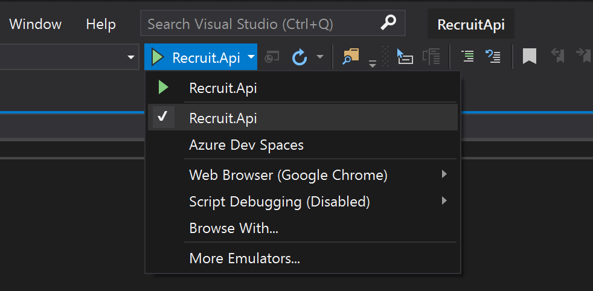

# SFA.DAS.Recruit.Api

|       |     |
| :---: | --- |
||SFA.DAS.Recruit.Api|
| Build | [](https://sfa-gov-uk.visualstudio.com/Digital%20Apprenticeship%20Service/_build/latest?definitionId=1631) |

&nbsp;

This repository represents the codebase for an API designed for internal use within the Digital Apprenticeship Service. The API will be used by other Digital Apprenticeship Service systems to retrieve data related to apprenticeship vacancies sourced from the system known as [Recruit an Apprentice](https://github.com/SkillsFundingAgency/das-recruit). Recruit an Apprentice is used by employers and approved training providers to post apprenticeship opportunities across England. The code in this repository is to be maintained by the DfE Apprenticeship Services team. Recruit.Api is a .NET 8 based web API designed to manage application reviews. It provides endpoints for retrieving, updating, and managing application reviews for different accounts and providers. The solution includes unit tests to ensure the reliability and correctness of the API.

&nbsp;

## Features
•	Retrieve application reviews by account ID or UKPRN.
•	Get dashboard counts for application reviews.
•	Update and upsert application reviews.
•	Comprehensive unit tests using NUnit and Moq.

## Contents

* [Endpoints](#endpoints)
    * [Sample API Responses](#sampleApiResponses)
        * [Application Reviews](#applicationReviews)        
    * [Authorization](#apiAuth)
    * [Known consumers of this API](#knownApiConsumers)
* [Development](#development)
    * [Requirements](#devReqs)
    * [Add configuration to Azure Storage Emulator](#localConfig)
    * [Logging](#logging)
    * [Running](#runningLocally)
        * [From terminal/command prompt](#fromTerminal)
        * [From within VSCode](#fromVsCode)
        * [From within Visual Studio](#fromVisualStudio)
        * [Once running](#onceRunning)
* [License](#license)

&nbsp;

<a id="endpoints"></a>
## Endpoints

Initially there are 5 endpoints that this API provides and they are all for retrieving data.

If you work on the Digital Apprenticeship Service, you can view the following [Environments](https://skillsfundingagency.atlassian.net/wiki/spaces/RAAV2/pages/200245289/Environments) page for the Recruit system to find the environment url's for the Recruit API:

https://skillsfundingagency.atlassian.net/wiki/spaces/RAAV2/pages/200245289/Environments
https://skillsfundingagency.atlassian.net/wiki/spaces/NDL/pages/4882923755/Application+Review+Migration

The URIs in the table below are relative to *https://localhost* for example purposes.

Endpoint | HTTP request | Description
------------ | ------------- | -------------
*Get Application Review by Id* | **GET**<br>/api/applicationReviews/{id} | Application Review Id is required.<br><br>This endpoint is a GET method in the ApplicationReviewController class.
*Get all Application Reviews by account Id* | **GET**<br>/api/employer/{accountId}/applicationReviews?pageSize=25&pageNo=1 | AccountId is required, other parameters are optional. PageSize defaults to 10 and PageNo to 1.<br><br>The application reviews are returned from this endpoint are ordered from newest first.
*Get all Application Reviews by ukprn* | **GET**<br>/api/provider/{ukprn}/applicationReviews?pageSize=25&pageNo=1 | ukprn is required, other parameters are optional. PageSize defaults to 10 and PageNo to 1.<br><br>The application reviews are returned from this endpoint are ordered from newest first.
*Insert new Application Review* | **PUT**<br>/api/applicationReviews/{id} | Application Review Id is required.<br><br>This endpoint is a PUT method in the ApplicationReviewController class used to add/insert new ApplicationReview.
*Upsert Application Review* | **PATCH**<br>/api/applicationReviews/{id} | Application Review Id is required.<br><br>This endpoint is a PATCH method in the ApplicationReviewController class used to update a ApplicationReview.

<a id="sampleApiResponses"></a>
### Sample API Responses (not real data)

<a id="vacancySummariesSample"></a>
#### Application Reviews
```json
{
    {
      "pageInfo": {
        "totalCount": 1,
        "pageIndex": 1,
        "pageSize": 25,
        "totalPages": 1,
        "hasPreviousPage": false,
        "hasNextPage": false
      },
      "applicationReviews": [
        {
          "id": "3fa85f64-5717-4562-b3fc-2c963f66afa6",
          "applicationId": "3fa85f64-5717-4562-b3fc-2c963f66afa6",
          "vacancyTitle": "string",
          "createdDate": "2025-03-28T13:54:01.960Z",
          "submittedDate": "2025-03-28T13:54:01.960Z",
          "dateSharedWithEmployer": "2025-03-28T13:54:01.960Z",
          "reviewedDate": "2025-03-28T13:54:01.960Z",
          "statusUpdatedDate": "2025-03-28T13:54:01.960Z",
          "withdrawnDate": "2025-03-28T13:54:01.960Z",
          "candidateId": "3fa85f64-5717-4562-b3fc-2c963f66afa6",
          "legacyApplicationId": "3fa85f64-5717-4562-b3fc-2c963f66afa6",
          "hasEverBeenEmployerInterviewing": true,
          "ukprn": 0,
          "accountId": 0,
          "accountLegalEntityId": 0,
          "vacancyReference": 0,
          "owner": "Employer",
          "status": "string",
          "additionalQuestion1": "string",
          "additionalQuestion2": "string",
          "candidateFeedback": "string",
          "employerFeedback": "string"
        }
      ]
    }
}
```

<a id="apiAuth"></a>
### Authorization

Requests to the API need to be authenticated and authorization is proved by submitting an OAuth Bearer Token in the HTTP header of the request. If you work on the Digital Apprenticeship Service you can request access keys from the Operations team for the environment you need.

&nbsp;

<a id="development"></a>
## Development

Note that for local running of the API, the authorization is disabled so no authorization token header needs to be submitted.

<a id="devReqs"></a>
### Requirements

In order to run this project locally you will need the following:

* [.NET Core SDK >= 8](https://www.microsoft.com/net/download/)
* (VS Code Only) [C# Extension](https://marketplace.visualstudio.com/items?itemName=ms-vscode.csharp)
* Access to an Azure Cosmos or MongoDb server (emulated or hosted) hosting the DAS Recruit database.
* Azure Storage Emulator (or [Azurite](https://github.com/Azure/Azurite) as an alternative)
* Azure Storage Explorer (Optional)

<a id="localConfig"></a>
### Add configuration to Azure Storage Emulator

1. Clone the [das-employer-config](https://github.com/SkillsFundingAgency/das-employer-config) repository.
2. For the above repository create your own branch based off of master. You should be rebasing this new branch on the origin master regularly as other teams within DAS will be updating the repository and configuration files contained within. **DO NOT** push this branch onto Github, it is for local use to your machine only.
3. Depending on if you are using the Cosmos emulator or Mongo to host the Recruit database you may need to change the connection string for the database in the file `/das-recruit-api/SFA.DAS.Recruit.Api_2.0.json`, once again on the branch you created in the previous step.
4. Run your local Azure Storage Emulator or [Azurite](https://github.com/Azure/Azurite) (in a container or natively) if you are using macOS.
5. Follow the instructions to import the config from the directory that you cloned the `das-employer-config repository` to and set your environment to `Development`.

> The above repositorie is private. If the links appear to be dead make sure that you are logged into GitHub with an account that has access to these i.e. that you are part of the [Skills Funding Agency Team](https://github.com/SkillsFundingAgency) organization.

Note that if you have used Azurite v2.7.0 or below, there is an issue in that you will be unable to edit values in a TableStorage row unless you update the row using code. It is for this reason that you use the branch created in step 2 above with the values specific to your local environment that you want and re-run the `das-employer-config-updater` as needed to replace the configurations stored in the `Configuration` storage table of your local storage account emulator.

<a id="logging"></a>
### Logging

The API logs messages to multiple targets. The primary target being logging to a local ELK stack via Redis configured via the `appSettings.Development.json`, `appSettings.json` and `nlog.config` files. The secondary target is to local file which will appear dated in the `bin/Debug/netcoreapp2.2/logs` directory after running.

<a id="runningLocally"></a>
### Running

There are various ways of running the project. Here are with instructions per platform below.

<a id="fromTerminal"></a>
#### From terminal/command prompt

macOS
```
ASPNETCORE_ENVIRONMENT=Development ConfigurationStorageConnectionString=UseDevelopmentStorage=true dotnet run
```

Windows cmd
```
set ASPNETCORE_ENVIRONMENT=Development
set ConfigurationStorageConnectionString=UseDevelopmentStorage=true
dotnet run
```

<a id="fromVsCode"></a>
#### From within VS Code

If running from VS Code only, then the `launch.json` should be made to look like the following:

```json
{
    // Use IntelliSense to learn about possible attributes.
    // Hover to view descriptions of existing attributes.
    // For more information, visit: https://go.microsoft.com/fwlink/?linkid=830387
    "version": "0.2.0",
    "configurations": [
        {
            "name": ".NET Core Launch (web)",
            "type": "coreclr",
            "request": "launch",
            "preLaunchTask": "build",
            "program": "${workspaceFolder}/Recruit.Api/bin/Debug/net8.0/SFA.DAS.Recruit.Api.dll",
            "args": [],
            "cwd": "${workspaceFolder}/Recruit.Api",
            "stopAtEntry": false,
            "launchBrowser": {
                "enabled": false,
                "args": "${auto-detect-url}/api/vacancies",
                "windows": {
                    "command": "cmd.exe",
                    "args": "/C start ${auto-detect-url}/api/vacancies"
                },
                "osx": {
                    "command": "open"
                },
                "linux": {
                    "command": "xdg-open"
                }
            },
            "env": {
                "ASPNETCORE_ENVIRONMENT": "Development",
                "APPSETTING_ASPNETCORE_ENVIRONMENT": "Development",
                "APPSETTING_ConfigurationStorageConnectionString": "UseDevelopmentStorage=true;"
            },
            "sourceFileMap": {
                "/Views": "${workspaceFolder}/Views"
            }
        },
        {
            "name": ".NET Core Attach",
            "type": "coreclr",
            "request": "attach",
            "processId": "${command:pickProcess}"
        }
    ]
}
```

> Note the above JSON is not valid as you can see by the commented out text at the top being highlighted red. VS Code handles this so it is okay.

&nbsp;

<a id="fromVisualStudio"></a>
#### From within Visual Studio

If using Visual Studio then the `launchSettings.json` file from Visual Studio or VS Code with the following would do:

```json
{
  "profiles": {
    "Recruit.Api": {
      "commandName": "Project",
      "launchBrowser": false,
      "environmentVariables": {
        "ASPNETCORE_ENVIRONMENT": "Development",
        "APPSETTING_ASPNETCORE_ENVIRONMENT": "Development",
        "APPSETTING_ConfigurationStorageConnectionString": "UseDevelopmentStorage=true;"
      },
      "applicationUrl": "http://localhost:5040/"
    }
  }
}
```

If wanting to debug from within Visual Studio then make sure you select the `Recruit.Api` profile selection from the debug drop down as show below:



If launching from outside Visual Studio and there exists the `Properties/launchSettings.json` file, from a terminal in the project working directory you can run the following to launch the API project:

> dotnet run --launch-profile "Recruit.Api"

<a id="onceRunning"></a>
#### Once running

The browser will not launch but the app should be running and you can start making requests to the API using [cURL](https://curl.haxx.se/), [Postman](https://www.getpostman.com/), web browser or any other http request making tools. If you want a browser to launch you will need to modify your `launchSettings.json`/`launch.json` file to do so.

To verify that the project is running with all its dependencies reachable, you can call the visit/call the https://localhost:5040/health url and expect a 200 HTTP response code. If for some reason, configuration or otherwise, the dependencies are not reachable the endpoint will return a 503 HTTP response code.

&nbsp;

<a id="license"></a>
## License

Licensed under the [MIT license](LICENSE)
